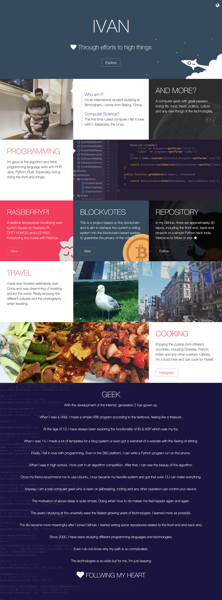

# About

Demo: http://www.yfgeek.com

This is a project for the homepage of my personal website. 

This project is build by Gulp.

For the user who want to edit this template, you should open the terminal and type

```bash
npm install
```

After that, once you've edit the language files in  `src/i18n` , you should type the command line `gulp` and wait for genrating the  css, javascript, html to  the destination folder.

| Folder name | Description                              |
| ----------- | ---------------------------------------- |
| src         | The source code folder                   |
| docs        | The generated folder, do not modify this folder |

Gulp reference: [gulpfile.js](gulpfile.js)

# Screenshot




# Copyright

Thanks to zeronet.io, who provied an awesome template. Just modifed some icons, pictures, layouts of the template.


# 关于

Demo: http://www.yfgeek.com

本项目是我的个人主页模板，用Gulp构建。

如果您想使用我的模板，您仅需要修改模板中的语言文件。

在修改之前，您需要打开终端，安装本项目的依赖：

```bash
npm install
```

执行之后，您需要在  `src/i18n`目录下编辑语言文件，一旦修改完毕，执行 `gulp`  命令将压缩编译后的代码生成到指定目录下。

| 目录名  | 描述                   |
| ---- | -------------------- |
| src  | 源代码路径，未经压缩版本         |
| docs | 生成路径，请勿自行更改这个目录的任何内容 |

Gulp文件 : [gulpfile.js](gulpfile.js)

# 截图


# 版权
非常感谢 zeronet.io 提供的绝佳模板创意与部分代码
本人对原有模板进行了修改，重新添加了图标、修改了部分布局，添加了图片

