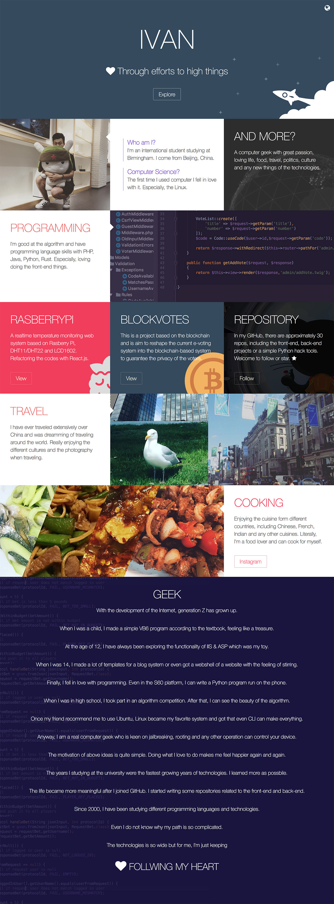
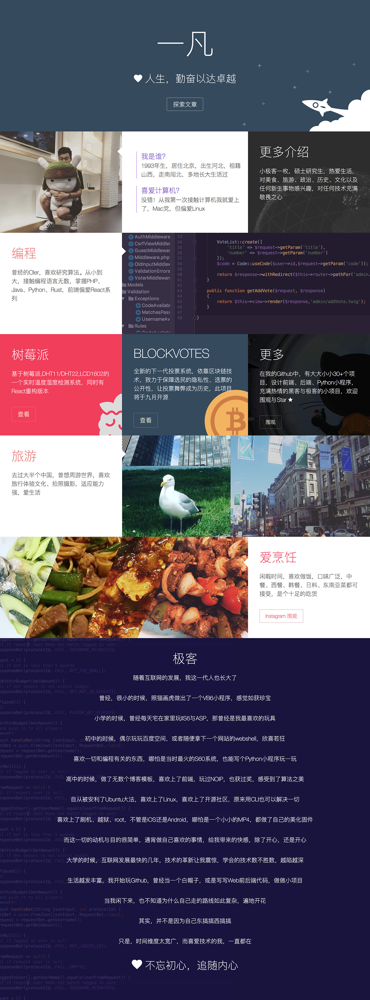

# About

Demo: http://www.yfgeek.com

This is a project for the homepage of my personal website. 

This project is build by Gulp.

For the user who want to edit this template, you should open the terminal and type

```bash
npm install
```

After that, edit the Windows homepage in `src/windows`, then run `gulp` to rebuild `docs`.

| Folder name | Description |
| ----------- | ----------- |
| `src/windows` | Windows-style homepage source |
| `docs` | Published Windows-style homepage |

Gulp reference: [gulpfile.js](gulpfile.js)

# Screenshot




# Copyright

Thanks to zeronet.io, who provied an awesome template. Just modifed some icons, pictures, layouts of the template.


# 关于

Demo: http://www.yfgeek.com

本项目是我的个人主页模板，用Gulp构建。

如果您想使用我的模板，您仅需要修改模板中的语言文件。

在修改之前，您需要打开终端，安装本项目的依赖：

```bash
npm install
```

执行之后，可在 `src/windows` 中维护 Windows 主页；修改完成后执行 `gulp` 重新生成 `docs`。

| 目录名 | 描述 |
| ---- | ---- |
| `src/windows` | Windows 风格主页源码 |
| `docs` | Windows 风格主页发布目录 |

Gulp文件 : [gulpfile.js](gulpfile.js)

# 截图



# 版权
非常感谢 zeronet.io 提供的绝佳模板创意与部分代码
本人对原有模板进行了修改，重新添加了图标、修改了部分布局，添加了图片

## Windows 风格主页

当前交互式 Windows 个人主页发布在 `docs/`，部署后访问 `https://www.yfgeek.com/`。
Windows 页面源码位于 `src/windows/`，默认使用 Windows XP Luna 主题，并兼容 Windows 98 与 Windows 2000 主题。
